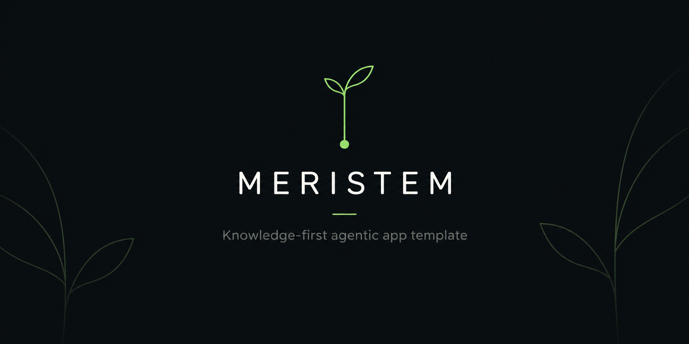

<p align="center">
  
</p>

# Meristem – Knowledge-first Agentic App Template

Meristem is a minimal, knowledge-driven template for building applications with AI agents.

It is not a technical starter — no framework, no boilerplate code.
It is a structured environment where agents operate based on explicit product knowledge and reusable skills, from which they can generate and evolve any application.

---

## Quick Start

```bash
git clone https://github.com/dsissoko/meristem.git my-app
cd my-app
```

Launch your agent (OpenCode, Claude Code, Codex CLI, OpenHands...) and start talking:

```
I want to build a task manager. React + Primer frontend, mocked backend.
```

The agent reads `AGENTS.md`, loads the Meristem process, and guides you from there.
No manual setup required — the agent handles everything.

---

## Structure

```txt
.
├── AGENTS.md                        ← agent process and rules
├── .opencode/skills/                ← skill bootstrap for OpenCode
├── .claude/skills/                  ← skill bootstrap for Claude Code
├── .gemini/skills/                  ← skill bootstrap for Gemini
├── .agents/skills/                  ← skill bootstrap for generic agents
├── .openhands/microagents/repo.md   ← OpenHands instructions
└── skills/
    ├── local/
    │   ├── discover-skills/
    │   ├── init-product-knowledge/
    │   ├── skills-health-check/
    │   └── spec-to-site/
    └── skills-presets.md
```

After first use, the agent creates `business.md`, `architecture.md`, `docs/specs/`, and `skills/skills.lock.md`.

---

## Skill Management

Skills are loaded automatically — the agent discovers them via the bootstrap skill in its native directory. No manual loading required.

### Core skills

Four skills are always available out of the box:

| Skill | What it does |
|-------|-------------|
| `init-product-knowledge` | Creates `business.md`, `architecture.md`, `docs/specs/` |
| `discover-skills` | Finds and recommends external skills for your stack |
| `skills-health-check` | Verifies integrity of all installed skills |
| `spec-to-site` | Generates a navigable site from `docs/specs/` |

### Presets

`skills/skills-presets.md` contains curated skill baselines for common stacks.
Presets are **user-managed** — you define them, enrich them over time, and share them across projects.
The agent proposes a matching preset based on your stack; you validate before anything is applied.

Meristem ships with a few example presets (e.g. `react-primer-spa`). Add your own as your practice evolves.

### Lock

Once skills are selected and validated, they are locked in `skills/skills.lock.md`.

The lock file:
- records the exact set of installed skills, their source, and their iteration (MVP, spec-phase, etc.)
- is the **single source of truth** for the agent — it reads this file before any task
- ensures reproducibility across sessions, agents, and team members

The lock is updated by the agent when new skills are downloaded or when a new iteration starts.

---

## Positioning

This repository is not a framework, a boilerplate, or a code generator.

It is a minimal foundation for agent-driven software development.
